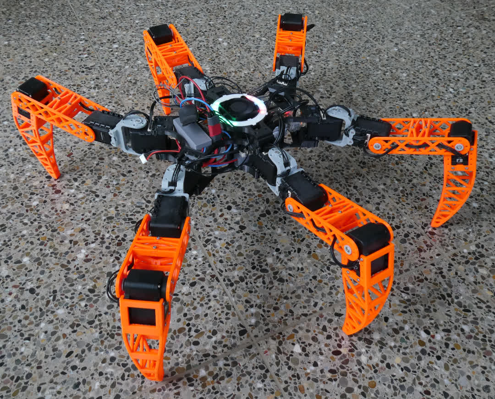
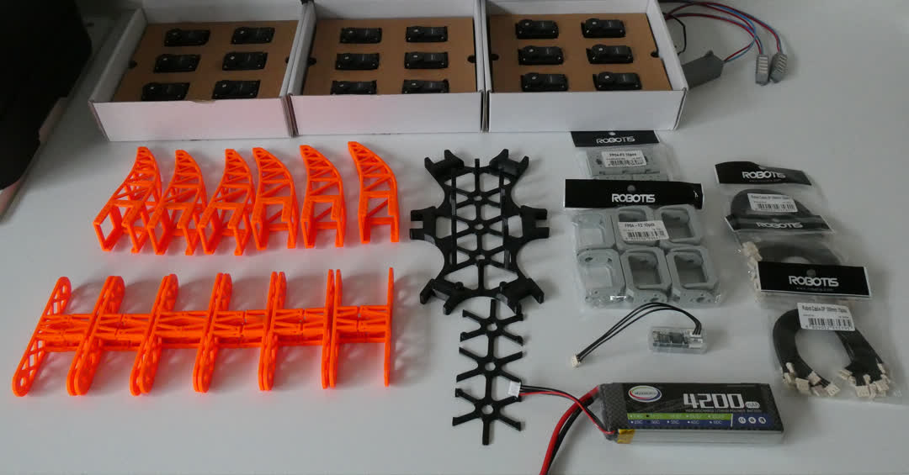
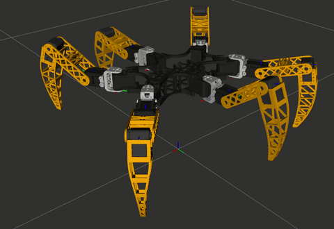

<!-- <h1 align="center">Project Leptan: 3D Printed, ROS2 Based Opensource Hexapod Robot</h1>

<p align="center">

  <a href="https://choosealicense.com/licenses/apache-2.0/">
    
  </a>
  <a href="https://project-leptan-docs.readthedocs.io/en/latest">
    
  </a>
</p>


<p align="center">
  
  <figcaption><b>Fig. 1 - Lepta, the first implementation of Project Leptan</b></figcaption>
</p>

## Overview

Project Leptan is an open source hexapod robot, based on the open source Robot Operating System ROS2.

The hardware consists of a Raspberry Pi 4 for as its brain, 18 pcs Dynamixel AX-12A digital Servo motors together with a serial interface for the Servo motors (something like a [U2D2](https://emanual.robotis.com/docs/en/parts/interface/u2d2/)). The frame and legs are 3D printed, assembled with a bunch of screws.
Other parts include a 3S LiPo battery, a DC/DC converter to supply the Raspberry and some cabling.
Optional Hardware used for better control is an LED ring as status & power indicator and a Voltage/Current meter for battery supervision.

Control of the robot is done using a joypad, right now an XBOX One Bluetooth joypad, which can be directly connected to the Raspberry.

There is also a visualization (RVIZ) which you can run on your PC without the physical robot. A proper simulation (Gazebo) is not yet implemented, but will come in the future.

| :warning: Disclaimer      |
|:---------------------------:|
| This is my first open source project. Let me know if something is wrong or how i can improve the project. |

### Motivation

I started the project to learn some more about robotics, and because i always thought these walking robots looked very cool and i wanted one. And since it is much cooler to build the robot yourself than to simply buy it, i started the project.

Also i wanted a platform to test some machine learning algorithms and other stuff, but i am not there yet. A walking robot can test algorithms and new stuff without the risk of a devastating crash like a drone would suffer.


### Status of the Project

Lepta can walk straight, turn, walk in circles or move its body without moving the feet.

The robot is controlled using a Bluetooth joy pad, as time of writing only the XBOX One joy pad has been configured.

**Lepta can perform the following actions as of time of writing:**
- Stand up/Sit down
- Rotate the body without moving the feet (prove of inverse kinematics)
- Walking straight in arbitrary direction with arbitrary speed
- Turning around arbitrary point with arbitrary speed

There is also a GTest framework with tests for the [inverse kinematics](https://en.wikipedia.org/wiki/Inverse_kinematics), movements etc.

**Planned features:**
- Adjustable gait height
- Adjustable step height
- Other gaits
- Various sensors like LIDAR, camera etc.
- SLAM
- ... (Let me know what you would like)

### Hardware


<figcaption><b>Fig.2 - The parts before assembly (screw and other small parts omitted)</b></figcaption>

\
Detailed instructions can be found in the [Docs](https://project-leptan-docs.readthedocs.io/en/latest/index.html).

### Naming

Lepta or Leptan is an abbreviation of Leptanillinae, which is a subfamily of ants. [Wikipedia](https://en.wikipedia.org/wiki/Leptanillinae)

Hexapods are 6 legged robots, resembling ants in many ways. Also Lepta/Leptan was quite free when performing web searches or regarding domains, preventing confusions in the future.

Also Lepta is female, because male ants are called Drones and a Hexapod is not a Drone.

## How to Install

You can either run the robot or the Visualization without the hardware robot.

### Robot

The detailed instructions can be found on [Read the Docs](https://project-leptan-docs.readthedocs.io/en/latest/Installation/RPi_setup.html).

### PC Visualization


<figcaption><b>Anim.1 - Lepta RVIZ visualization walking.</b></figcaption>

\
For using the PC visualization a joypad is required. Right now only an XBOX One joypad has been programmed.
Other input device will be implemented as requests arise and hardware for testing is available.

Install the full Desktop version of [ROS2 Foxy](https://docs.ros.org/en/foxy/Installation.html).

Install Colcon:
```bash
sudo apt install python3-colcon-common-extensions
```

Clone the Repo:
```bash
git clone --recurse-submodules https://gitlab.com/Combinatrix/project-leptan.git
```

Install xacro used for the model building:
```bash
sudo apt install ros-foxy-xacro
```

## Usage

Clone the project from [Gitlab](https://gitlab.com/Combinatrix/project-leptan).

Source ROS2 as described in the installation package
```bash
source /opt/ros/foxy/setup.bash
```

Build the project:
```bash
colcon build
```

Or build the project and run the tests:
```bash
colcon build && colcon test && colcon test-result --verbose
```

Source generated files:
```bash
source install/setup.bash
```
&rarr; Connect the joypad.

Launch the visualization:
```bash
ros2 launch launch_files hexapod_launch.py
```

The launch file checks if it is run on a Raspberry or not. According to this either the robot or the visualization is started.

## Contributing
Pull requests are welcome. For major changes, please open an issue first to discuss what you would like to change.

Please make sure to update tests as appropriate.

### Author

- Pascal Voser

### Contributors

-

### Proofreaders

- Yaw Lam

## License

[](https://choosealicense.com/licenses/apache-2.0/) -->
